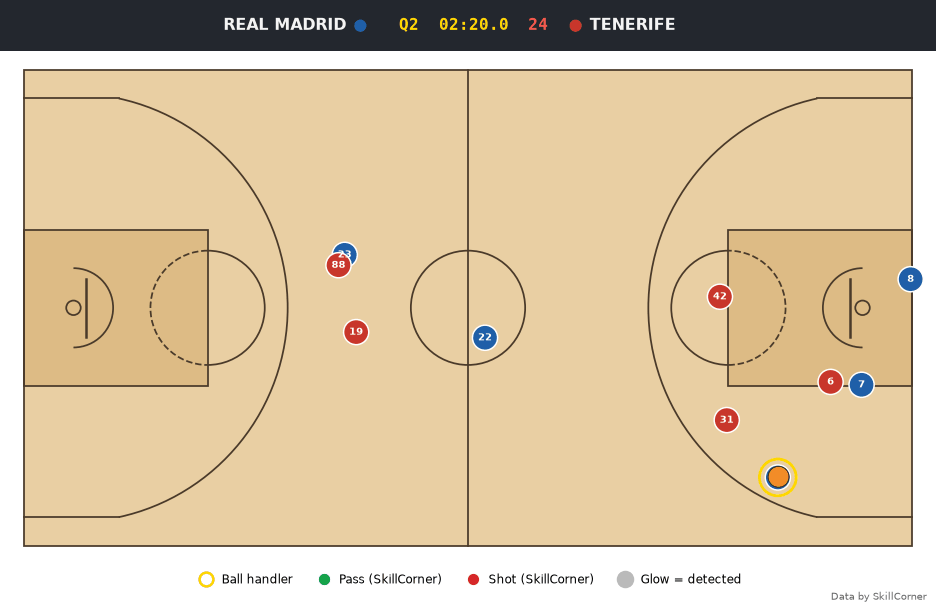
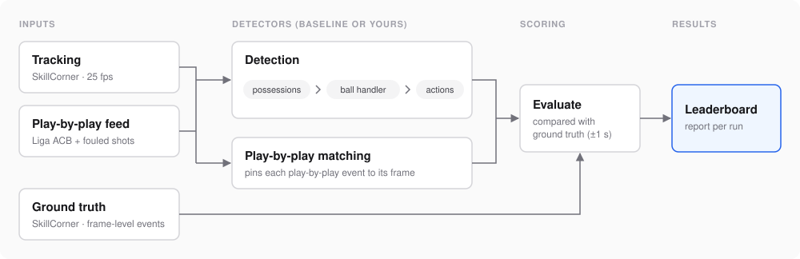

<h1 align="center">Basketball Action Detection Benchmark 🏀</h1>

<p align="center">
  
  
  <a href="https://github.com/SkillCorner/opendata-basketball"></a>
  <a href="https://ojs.aaai.org/index.php/AAAI/article/view/20861"></a>
</p>

<p align="center">
  A benchmark for detecting basketball actions from player and ball tracking data and a play-by-play feed.
  <br>
  Built on <a href="https://github.com/SkillCorner/opendata-basketball">SkillCorner's open basketball tracking data</a>,
  with the action-detection methodology introduced in <a href="https://ojs.aaai.org/index.php/AAAI/article/view/20861">Q-Ball (AAAI 2022)</a> included as a baseline.
</p>

<p align="center">
  
  <br>
  <sub>One possession of game 184439. Green ball = pass, red ball = shot (SkillCorner's labels); glow = detected by the heuristic baseline; gold ring = detected ball handler.</sub>
</p>

## Overview

The benchmark provides frame-level ground truth for evaluating basketball action detectors on
tracking data, so that methods can be compared reproducibly.

A detector receives player and ball tracking data and a play-by-play feed timestamped to the second.
It reconstructs which team is in possession, which player controls the ball at each frame, and when
actions such as passes and shots occur.

Earlier tracking studies, including Q-Ball, detected actions with hand-crafted rules, but without
frame-level labels their accuracy could not be measured. SkillCorner's open data labels the exact
frame and location of each event, so this benchmark scores detectors against those labels, across
ten Liga ACB games, with a common set of metrics.

Two tasks are scored independently, both with the tracking and the feed as input:

- **Detection.** Output possessions, the ball handler and actions at frame level. The feed provides
  *what* happened and *who* did it; the detector finds *when* and *where*. Detectors may use the
  feed, but are not required to.
- **[Play-by-play matching](docs/submission.md#play-by-play-matching).** Output the tracking frame,
  and optionally the location, of each feed row.

> [!IMPORTANT]
> The play-by-play feed is the official Liga ACB scoresheet, written courtside and independent of
> the tracking and of SkillCorner's labels, plus the missed shots that drew a foul, which FIBA
> scoring leaves out ([why](docs/data.md#the-added-rows-missed-shots-that-drew-a-foul)). This
> repository does not redistribute ACB data: `python runner.py fetch-acb` downloads your own copy.

## Workflow

<p align="center"></p>

1. **Fetch** the data: `fetch` downloads the games, `fetch-acb` the play-by-play feed.
2. **Run** a detector: `detect` or `match-pbp` writes a run folder of CSV tables.
3. **Evaluate** the results: `evaluate` scores the run folder against the ground truth and updates
   the leaderboard.
4. **Visualize** the run: `visualize` animates it on the court, with SkillCorner's labels overlaid.

## Quick Start

```bash
git clone https://github.com/chenyanai/basketball-actions-detection-benchmark.git
cd basketball-actions-detection-benchmark
pip install -r requirements.txt
python runner.py fetch                                               # tracking and labels, about 360 MB
export ACB_API_KEY=...                                               # required for the ACB play-by-play feed
python runner.py fetch-acb                                           # the play-by-play feed
python runner.py detect baselines.heuristic --games 114099 --check   # one game, prints the score
```

This downloads the tracking data, builds the play-by-play feed, and runs the heuristic baseline on
one game. [`docs/data.md`](docs/data.md) explains where the API key comes from.

To run the benchmark across all ten games:

```bash
python runner.py detect baselines.heuristic      # writes runs/heuristic/
python runner.py evaluate runs/heuristic         # writes results/heuristic.json and updates the leaderboards
python runner.py visualize runs/heuristic 184439 --frames 52970:53305 --truth --out clip.gif   # the clip above
```

## Leaderboard

Results across all ten games. Every column is a share where higher is better, except median abs Δt,
where lower is better; in the detection table the best value in each column is in bold. `evaluate`
regenerates these tables and [`results/leaderboard.md`](results/leaderboard.md). To add a method,
see [Submit a Detector](#submit-a-detector).

<!-- leaderboard:start -->
### Detection

| detector   | possession frames   | possession F1   | ball handler   | complete possessions   | pass F1   | shot F1   | rebound F1   | turnover F1   | foul F1   |
|------------|---------------------|-----------------|----------------|------------------------|-----------|-----------|--------------|---------------|-----------|
| heuristic  | **91.9%**           | **56.8%**       | **78.8%**      | **29.7%**              | **77.3%** | **87.6%** | **71.3%**    | **52.5%**     | 49.0%     |
| naive      | 82.1%               | 33.0%           | 78.3%          | 19.4%                  | 66.4%     | 84.0%     | –            | –             | –         |
| pbp_clock  | –                   | –               | –              | 45.7% (actions only)   | –         | 33.9%     | 37.5%        | 42.1%         | **65.1%** |

### Play-by-Play Matching

| matcher   | F1    | within 1 s   | median abs Δt   | shot F1   | rebound F1   | turnover F1   | foul F1   |
|-----------|-------|--------------|-----------------|-----------|--------------|---------------|-----------|
| heuristic | 73.6% | 73.6%        | 0.24 s          | 85.5%     | 70.3%        | 53.6%         | 51.2%     |
| pbp_clock | 39.5% | 39.5%        | 1.44 s          | 32.2%     | 37.7%        | 42.3%         | 64.7%     |
<!-- leaderboard:end -->

**Detection columns**

| Column | Meaning |
|---|---|
| possession frames | share of live-play frames assigned to the team in possession |
| possession F1 | F1 score of whole possessions: a detected possession counts when it names the right team and overlaps a true one with IoU ≥ 0.5 |
| ball handler | share of live-play frames with the right player in control, or no player while the ball is loose |
| complete possessions | share of possessions segmented correctly in which every action was also detected, with the right player, within 2 s |
| F1 | detections matched within 1 s of the labelled frame |
| – | stage or action type not implemented |
| (actions only) | no possessions of its own, so only the actions are checked; not comparable with the rows above and never bold |

**Play-by-play matching columns**

| Column | Meaning |
|---|---|
| F1 | a row placed within 1 s of the labelled frame is correct; precision is over the rows the matcher returns, recall over all rows |
| within 1 s | share of all feed rows placed within 1 s, which is also the recall; equal to F1 when a matcher returns every row, as both baselines do |
| median abs Δt | typical timing error: the median, so a few rows placed a whole stoppage away don't dominate |

## Baselines

The three baselines isolate what each source gives:

- **naive**, tracking only. The nearest player has the ball, a handler change between teammates is a
  pass, and a ball above the rim is a shot.
- **heuristic**, tracking and the feed. Q-Ball's rule-based procedure, adapted to SkillCorner data:
  the feed gives each possession its events and players, and the tracking places them. It is also
  the baseline matcher; see [`docs/heuristic.md`](docs/heuristic.md).
- **pbp_clock**, the feed only. It places each row at the middle of its clock second, which shows the
  score obtainable from the feed alone. Actions stage only.

The ground truth also has screens, drives, isolations, posts and closeouts. They are not in the feed
and no baseline detects them yet, but they are scored for any submission that returns them.

## Submit a Detector

1. Copy a template from [`examples/`](examples/) and keep the functions you implement:

   ```python
   def detect_possessions(game, pbp):                                    # period, start_frame, end_frame, team_id
   def detect_ball_handler(game, pbp, possessions=None):                 # frame_idx, player_id (empty = nobody)
   def detect_actions(game, pbp, possessions=None, ball_handler=None):   # one row per action
   ```

   A stage you skip passes `None` to later stages, never the ground truth, which would give away the
   answers.

2. Work on one game. `--check` validates every table, points to the first bad row, and prints the score:

   ```bash
   python runner.py detect my_detector.py --games 114099 --check
   ```

3. Run all ten games and open a pull request with `results/<name>.json` and the updated leaderboards:

   ```bash
   python runner.py detect my_detector.py
   python runner.py evaluate runs/my_detector
   ```

[`docs/submission.md`](docs/submission.md) has the details: the inputs, the action table, the
play-by-play matching task, run folders, and the heuristic's settings.

## Evaluation

Only live play is scored, and actions are matched blind: same period and type, closest first,
within 1 s. [`docs/metrics.md`](docs/metrics.md) defines every metric and matching rule.

> [!NOTE]
> Don't train or tune on the benchmark games. If you did, report only on the held-out games 114243,
> 179612 and 191313, and say which games your method saw.

## The Data

The benchmark uses two independent sources, and stores neither.

- **Tracking and ground truth**: [SkillCorner's open basketball data](https://github.com/SkillCorner/opendata-basketball),
  under the MIT license. `python runner.py fetch` downloads it.
- **The play-by-play feed**: the official Liga ACB scoresheet. `python runner.py fetch-acb`
  downloads your own copy, with your own API key.

[`docs/data.md`](docs/data.md) covers both: what the benchmark keeps from each, how accurate the
feed's clock is, where the API key comes from, and why the feed adds the missed shots that drew a
foul.

## Contributing

- **A new detector**: follow [Submit a Detector](#submit-a-detector).
- **A new action type**: add it to `schema.ACTION_TYPES`, extract its ground truth in
  `data_loader/skillcorner.py`, and add it to the action table in
  [`docs/submission.md`](docs/submission.md).
- **A change to a baseline**: `tests/test_baselines.py` pins its scores on an excerpt of game 114099,
  kept locally in `tests/data/excerpt/` because the data cannot be shipped; without it those tests
  skip with a warning. Update the pinned scores in the same pull request and say why they changed.

Before opening a pull request, run `pip install pytest ruff==0.16.8`, then
`ruff check . && ruff format --check .` and `python -m pytest`.

```text
runner.py         the command line, and how a submission and its run folder work
schema.py         the output tables and the action vocabulary
visualization.py  animated clips of a run on the court
data_loader/      the games, their ground truth, the ACB feed, and NBA SportVU data
evaluation/       matching, metrics, reports and the leaderboard
baselines/        naive.py, pbp_clock.py and heuristic/, whose per-action rules are in heuristic/detectors/
examples/         submission templates
docs/             the data, the submission format, the metrics, and the heuristic in detail
results/          committed reports and the leaderboard
```

## Citation

If you use the benchmark or its baselines, please cite this repository:

```bibtex
@misc{yanai2026basketballactions,
  title        = {Basketball Action Detection Benchmark},
  author       = {Yanai, Chen},
  year         = {2026},
  howpublished = {\url{https://github.com/chenyanai/basketball-actions-detection-benchmark}}
}
```

Related work, Q-Ball ([AAAI 2022](https://ojs.aaai.org/index.php/AAAI/article/view/20861),
[doi:10.1609/aaai.v36i8.20861](https://doi.org/10.1609/aaai.v36i8.20861)):

```bibtex
@inproceedings{yanai2022qball,
  title     = {Q-Ball: Modeling Basketball Games Using Deep Reinforcement Learning},
  author    = {Yanai, Chen and Solomon, Adir and Katz, Gilad and Shapira, Bracha and Rokach, Lior},
  booktitle = {Proceedings of the AAAI Conference on Artificial Intelligence},
  volume    = {36},
  number    = {8},
  pages     = {8806--8813},
  year      = {2022},
  doi       = {10.1609/aaai.v36i8.20861}
}
```

## Acknowledgements

The tracking data and ground-truth events come from
[SkillCorner's open basketball data](https://github.com/SkillCorner/opendata-basketball), released
under the MIT license; please credit SkillCorner when you use it. The play-by-play feed is Liga ACB's
official scoresheet, which each user downloads; this repository adds only the missed shots that drew
a foul. Neither source's data is stored in this repository.

The code is released under the [MIT license](LICENSE).
